# Testes do banco no Supabase

Evidências dos testes feitos no SQL Editor do Supabase em **01/10/2026**, depois de aplicar `02`, `03`, `04` e `05`. As imagens estão em [img/testes-banco/](img/testes-banco/). Para repetir os testes, veja "Testes rápidos" em [guia-banco.md](guia-banco.md#testes-rápidos).

> **Dados dos testes 4 e 5.** Os testes de `pontos_proximos` com "Lata de alumínio" (raios `inicial`, `ampliado` e `mais_proximo`) foram feitos com dois pontos provisórios chamados `[TESTE]`, que existiam só para o teste. Eles foram removidos: a contagem de 14 pontos (seção 5) são só os reais. O teste com os pontos reais está na seção 6.
> Os resíduos "Lata de alumínio" e "Pilhas e baterias" foram ativados (`ativo = true`) para os testes de busca. Eles devem voltar a `ativo = false` até a conferência das orientações; confirme com `select nome, ativo from residuos;`.

## 1. Estrutura

As funções existem no banco:

```sql
select proname from pg_proc where proname in ('distancia_km', 'buscar_residuos', 'pontos_proximos');
```

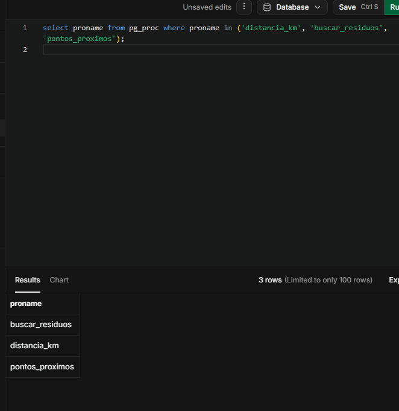

Diagrama do schema (6 tabelas do `02`, mais `users` do `init_db.sql`):

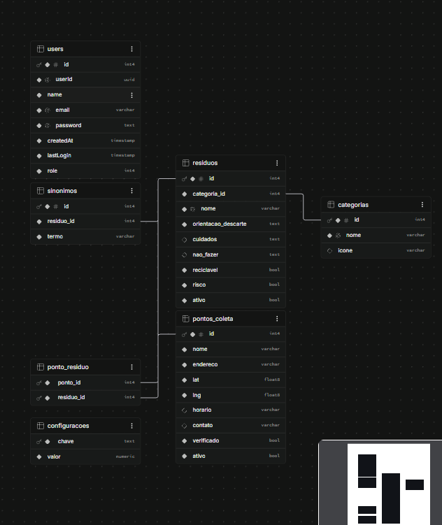

## 2. `distancia_km`

| Teste | Esperado | Resultado |
| --- | --- | --- |
| `distancia_km(0, 0, 1, 0)` (1 grau de latitude) | cerca de 111,19 km | 111,19 km |
| `distancia_km(-8.28, -35.97, -8.28, -35.97)` (mesmo ponto) | 0 | 0 |

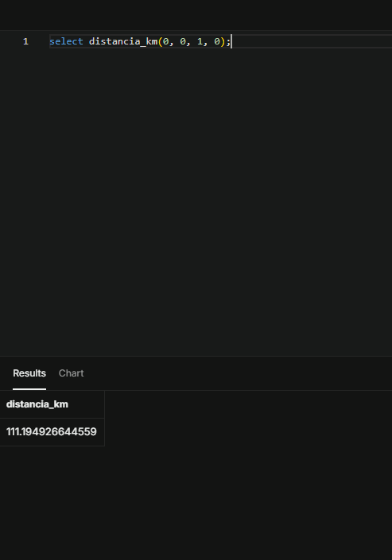
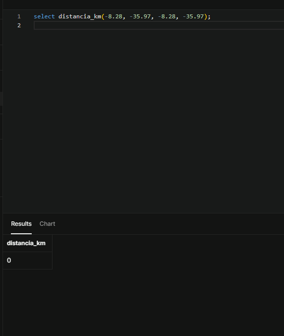

## 3. `buscar_residuos`

| Busca | Esperado | Resultado | Imagem |
| --- | --- | --- | --- |
| `'latinha'` com resíduos inativos | nada (só entram resíduos `ativo = true`) | sem linhas | [ver](img/testes-banco/busca-latinha-sem-ativar.png) |
| `'latinha'` depois de ativar | Lata de alumínio (pelo sinônimo) | Lata de alumínio, similaridade 1 | [ver](img/testes-banco/busca-latinha.png) |
| `'pilah'` (erro de digitação) | Pilhas e baterias | Pilhas e baterias, similaridade 0,33 | [ver](img/testes-banco/busca-pilah.png) |
| `'ALUMINIO'` (maiúsculas, sem acento) | Lata de alumínio | Lata de alumínio, similaridade 1 | [ver](img/testes-banco/busca-aluminio-maiusculo.png) |
| `'zzzz'` (sem sentido) | lista vazia, sem erro | sem linhas | [ver](img/testes-banco/busca-sem-resultado.png) |
| `'a'` (uma letra) | lista vazia (mínimo de 2 letras) | sem linhas | [ver](img/testes-banco/busca-uma-letra.png) |

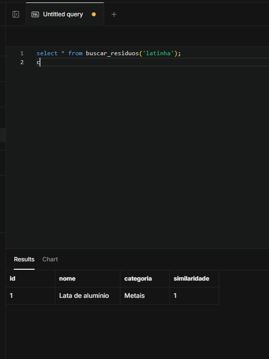
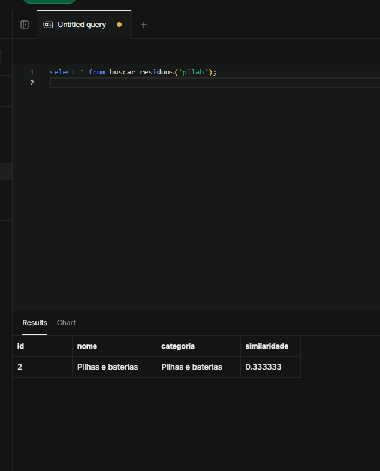

## 4. `pontos_proximos` (com pontos `[TESTE]`)

| Posição do usuário | Esperado | Resultado | Imagem |
| --- | --- | --- | --- |
| Em cima do ponto 1 | só o ponto 1, `raio_usado = inicial` | distância 0, `inicial` | [ver](img/testes-banco/pontos-raio-inicial.png) |
| A cerca de 15 km | pontos até 25 km, `raio_usado = ampliado` | 2 pontos (15,4 e 24,4 km), `ampliado` | [ver](img/testes-banco/pontos-raio-ampliado.png) |
| A cerca de 87 km | só o ponto mais perto, `raio_usado = mais_proximo` | 1 ponto (86,7 km), `mais_proximo` | [ver](img/testes-banco/pontos-mais-proximo.png) |
| Resíduo que nenhum ponto de teste aceita (Pilhas) | lista vazia (RN01) | sem linhas | [ver](img/testes-banco/pontos-residuo-sem-ligacao.png) |

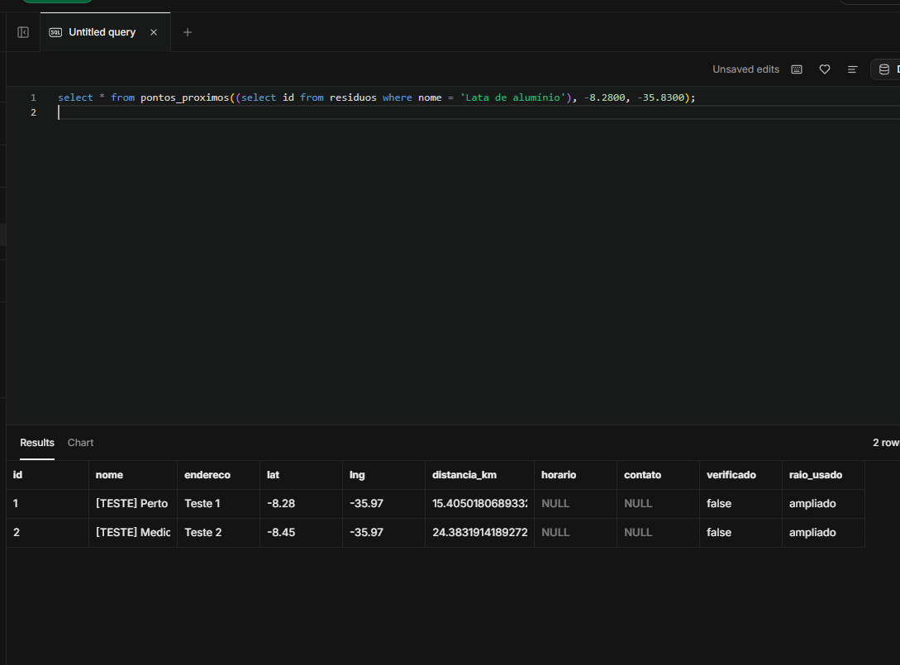
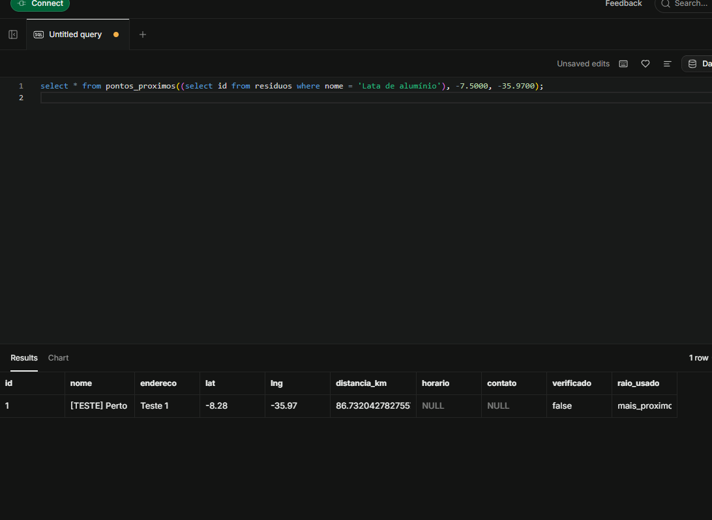

O último teste confirma a RN01: um ponto só aparece para o resíduo que ele aceita.

## 5. Contagens depois de aplicar o `05`

| Consulta | Esperado | Resultado |
| --- | --- | --- |
| `select count(*) from pontos_coleta;` | 14 | 14 |
| `select count(*) from ponto_residuo;` | 30 | 30 |

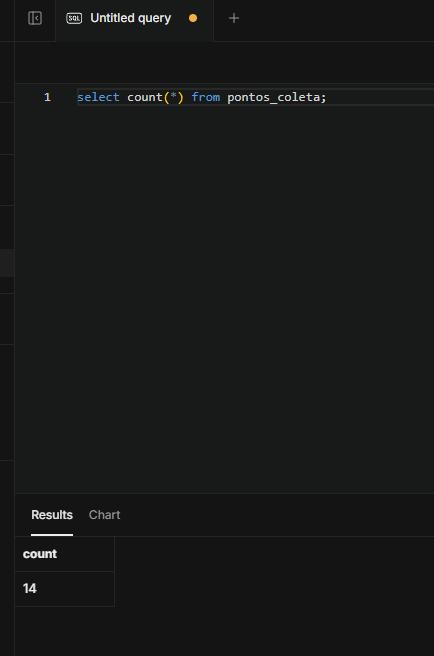
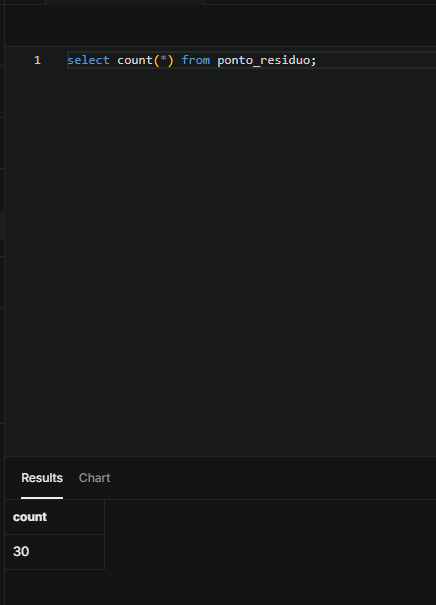

Se uma ligação do `05` tivesse um nome de resíduo diferente do cadastrado, ela sumiria sem erro e o total ficaria abaixo de 30. Por isso essa contagem é obrigatória depois de aplicar.

## 6. `pontos_proximos` com os pontos reais

```sql
select * from pontos_proximos(
  (select id from residuos where nome = 'Pilhas e baterias'),
  -8.2830, -35.9700
);
```

Resultado: **10 pontos**, ordenados por `distancia_km` (de 0,16 km a 5,11 km), com `horario` e `contato` `NULL` e `verificado = false`. São as 5 Drogasil, o Caruaru Shopping, o Assaí, o Polo Comercial, a Ferreira Costa e a Casas Bahia, exatamente os que aceitam pilhas.

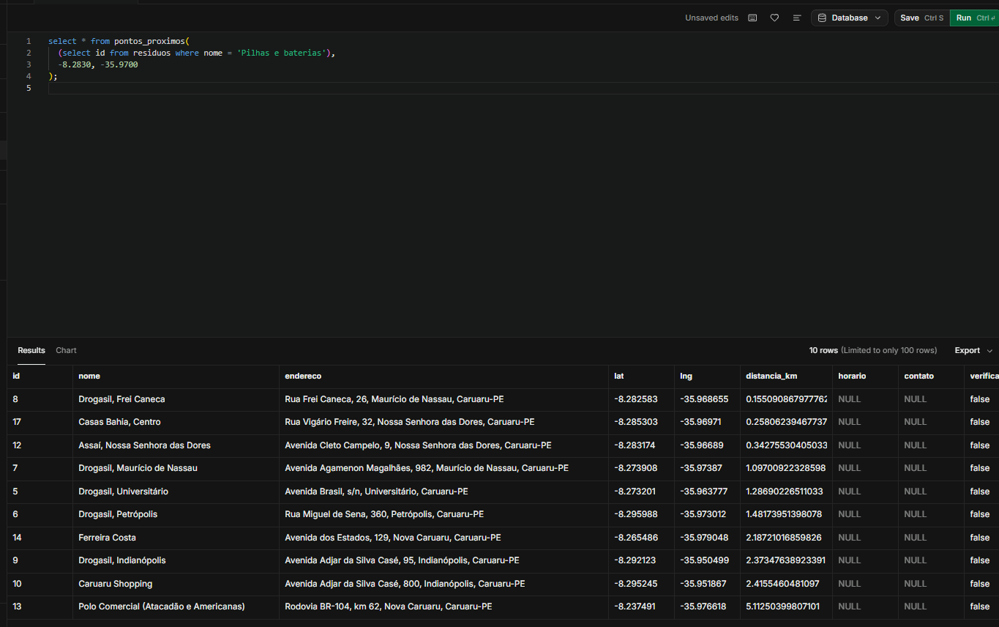

## O que ainda não foi testado

- A busca por texto depois da liberação oficial dos 9 resíduos.
- `pontos_proximos` para os demais resíduos (medicamentos, lâmpadas, eletrônicos, óleo e recicláveis) com os pontos reais.
- Os endpoints da API chamando essas funções.
